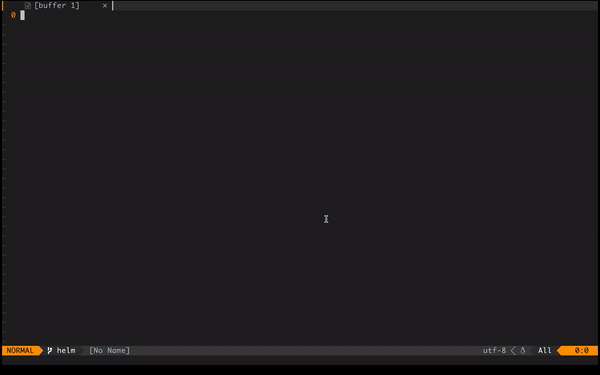

# Nvim-k8s
Vim-k8s is a [k9s](https://github.com/derailed/k9s) wrapper that will make your life easier when you are working with Kubernetes. You dont need to leave the nvim window anymore to control and debug your kubernetes clusters.




# Installation

**Using [vim-plug](https://github.com/junegunn/vim-plug)**

```vimscript
Plug 'hsalem7/nvim-k8s'
```

# Usage
To open the k9s window you can use `Alt + p` and use the same keys combinations to close it

# Configuration
To change the keybinding that oppens the k9s window you can set the global variable as:
```vimscript
let g:vim_k8s_toggle_key_map = '<C-p>'
```
this will let the `Ctrl-P` toggle the k8s window
